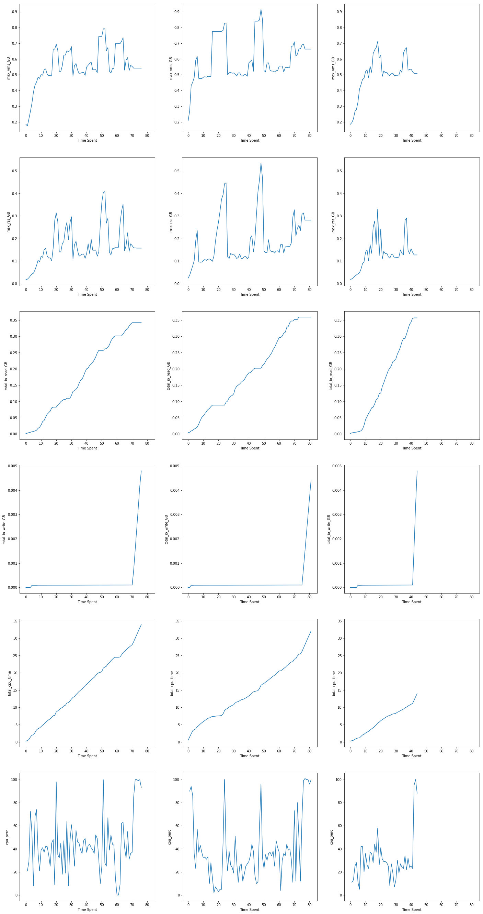
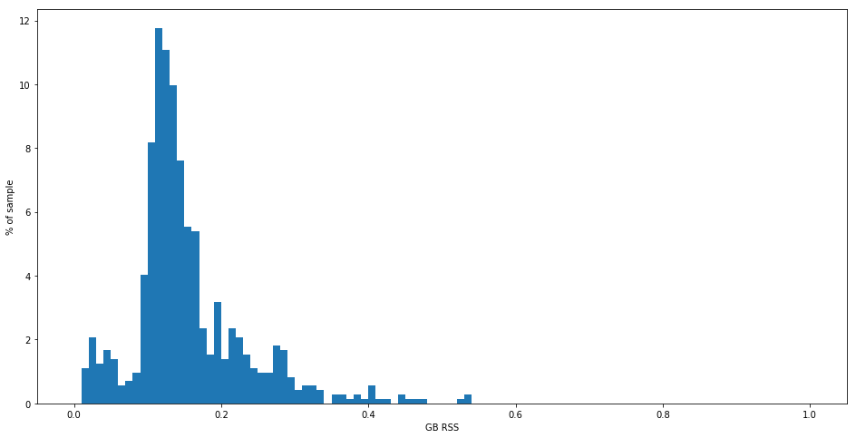
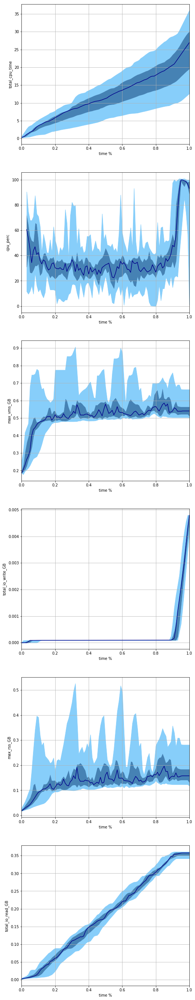
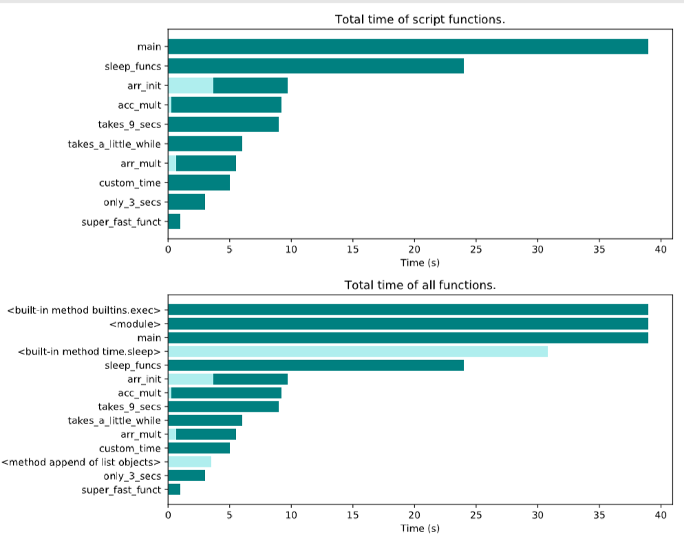
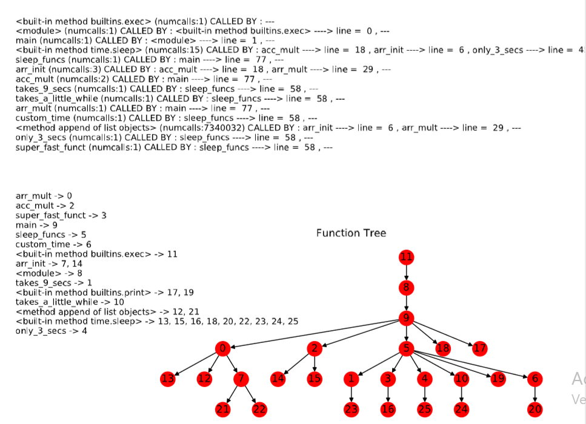
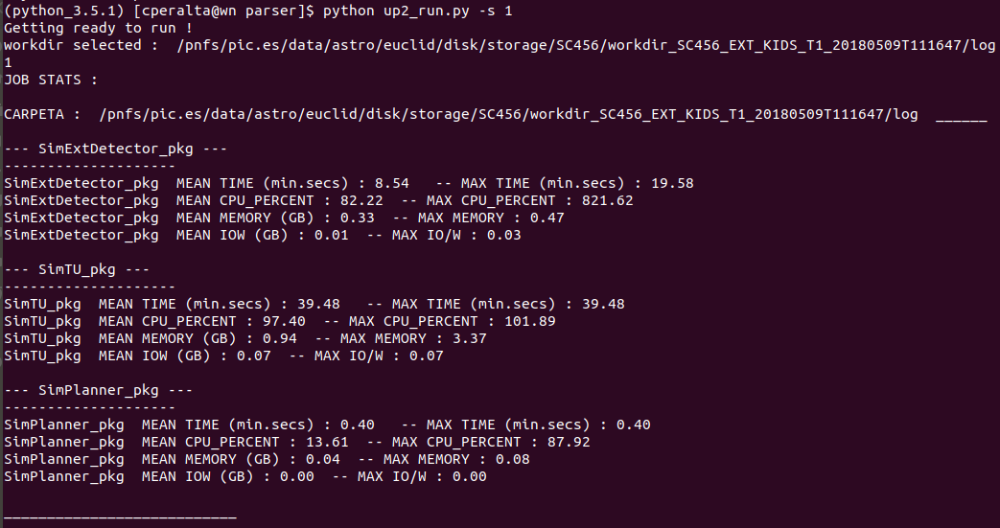
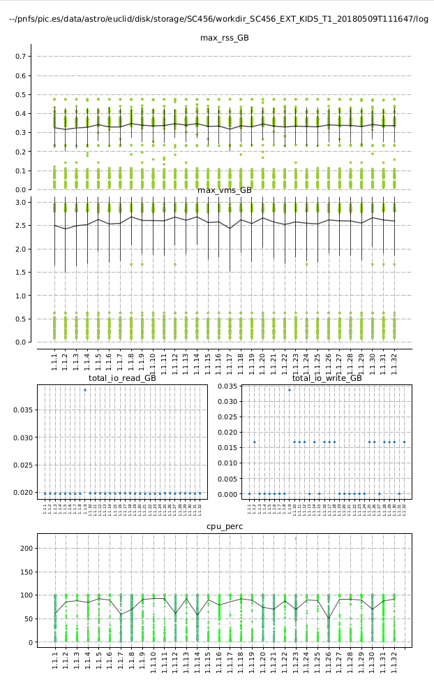

# Introduction

This package provides a script based on the python `psutil` package to run and monitorize a shell process.

The main figures of the process and its children are monitored and logged to a log file.
The script can capture the logging directory from the `logdir` parameter inside the command it's going to run.

Some of the figures enabled are:

* Max RSS (`max_rss`)
* Max VMS (`max_vms`) 
* Total I/O read and written (`total_io_read` and `total_io_write`)  
* Total CPU time (`total_cpu_time`)

The figures are written to a csv file at the end of each period.

Although this package can be used in any environment is has been developed to be used within the Euclid SGS infrastructure.
That is, with `euclid-ial-wfm` and `euclid-ial-drm`.

For those familiar with the Euclid SGS infrastructure, this package is not structured as an Elements package.


# Installation

Clone the PipelineUtils repository [PipelineUtils Gitlab repository](https://gitlab.euclid-sgs.uk/SDC-ES/PipelineUtils)
```
> git clone https://gitlab.euclid-sgs.uk/SDC-ES/PipelineUtils.git
```


Move to the package directory and install via the execution of the setup script. Need to have `setuptools` installed.

```
> cd PipelineUtils/run_and_monitorize
> sudo python setup.py install
```

You can also install it via pip as: 

```
> python3 -m pip install git+https://github.com/crispq95/var_monitor_v2@master 
```

Or update it if needed as 

```
> python3 -m pip install --upgrade git+https://github.com/crispq95/var_monitor_v2@master 
```


# Usage

Run the script with the `-h` argument to see the options available:

```
> run_and_monitorize -h
usage: run_and_monitorize [-h] --command COMMAND [--conf CONF]
```

Standard usage would be:
```
    run_and_monitorize -c "{command}"
```

By default the configuration file will be picked from `/etc/run_and_monitorize/run_and_monitorize.cfg`


# Integration with IAL

In order to integrate this monitoring tool with IAL do:


in `$HOME/.ial_drm/conf.ini` add

	extra_commands_before = /path/to/some/script \

create `/path/to/some/script` with

	#!/bin/bash
	EUCLIDJOB="$@"
	/path/to/run_and_monitorize --command="$EUCLIDJOB" --conf /path/to/run_and_monitorize.cfg


# Configuration

Sample configuration file:

```
[root]
var_list=max_vms,max_rss,total_io_read,total_io_write,total_cpu_time ; list of variables to monitorize
check_lapse=0 ; time between each usage check in seconds
report_lapse=1 ; time between each usage report in seconds

[HS06]
HS06_factor_func=/home/cperalta/Desktop/p_final/VarMonitor/hs06dir/cpu2mult

[logging]
logfile=usage.log 
logdir=/home/cperalta/Desktop/p_final/VarMonitor/logdir
logdir_implicit=0 ; boolean, set to True if logdir parameter is inside command to be monitorized
```


## root settings

* var_list: list of variables to be monitorized as comma-separated string. To choose among listed above.
* check and reporting period: the process figures are checked every `check_lapse` and logged every `report_lapse`. 

## HS06 setting:

* HS06_factor_funct: path to reach HS06 factor file

## Logging settings:

* logging directory: Implicit `logdir` inside command has precedence over explicit `logdir` option. If none of them exists `cwd` will be assumed as logging directory.
* log file: `logfile` or `usage.log` will be joined to logdir


# Parsing the csv usage files

Create a UsageParser instance and load the information from the usage files.

```
from var_monitor import usage_parse
parser = usage_parse.UsageParser()
parser.load_log_files(['wildcard/to/csv/files/1', ..., 'wildcard/to/csv/files/N])
```

Plot some samples:
```
parser.plot_sample(sample_size=3)
```


Compute and plot some additional stats:
```
parser.plot_additional_stats()
```


Plot the 0%, 25%, 50%, 75% and 100% percentiles of the resources usage at each % of total time spent.
```
parser.plot_value_range()
```


To get plots by job you may use scripts/single_job_parser.py

```
> python scripts/single_job_parser.py -j '/mnt/c/Users/cris/Desktop/pic/workdir_SC456_NIP_FLAT_F1_*/call_pointing.iterations.1.SimReducer_pkg/usage_*' -opt 1,2,3
```

Results will be saved on /plots (you can modify the folder with -pth) and are the same plots shown above. 

To get the time plots for a job you may use scripts/time_test.py as :

```
> python scripts/time_test.py -j  -d path/cProfile_output
```

Results will be the following: 





You can also use scripts/usageparser_run.py to get jobs data classified by type of job and ordered by folder, or to get max/mean stats for the jobs on a folder. 

```
> python usageparser_run.py -s 1 -p 1 -wdr /pnfs/pic.es/data/astro/euclid/disk/storage/SC456/workdir_SC456_EXT_KIDS_T1_*/log -j SimExtDetector_pkg,SimTU_pkg,SimPlanner_pkg -sz SimExtDetector_pkg -m 4 -w 10 
```
For further information about usageparser_run.py use the argument **-h**.



